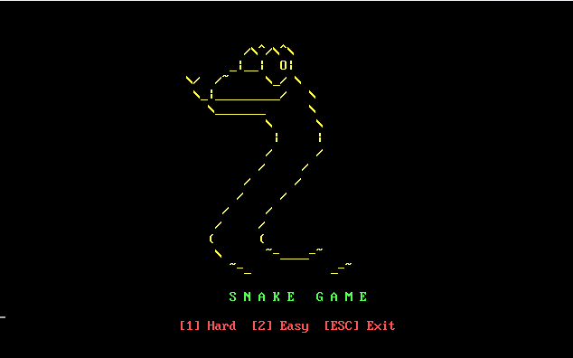
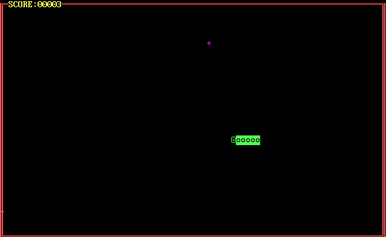

🐍 8088 Snake Game - Assembly Language

A classic Snake Game implemented in Assembly Language for the 8088 platform. This project is part of the COAL (Computer Organization & Assembly Language) course at FAST-NU Lahore, Spring 2025.



📋 Features
- Real-time keyboard input using arrow keys
- Random food generation
- Score tracking system
- Game over on wall or self collision
- Option to restart or exit after game over

🧠 Concepts Demonstrated
- Direct video memory manipulation (text mode)
- BIOS/DOS interrupts for input/output
- Game loop logic
- Collision detection
- Random food generation

🚀 Getting Started
1. Clone the repo:
   ```bash
   git clone https://github.com/sdnr1418/8088-Snake-Game.git
